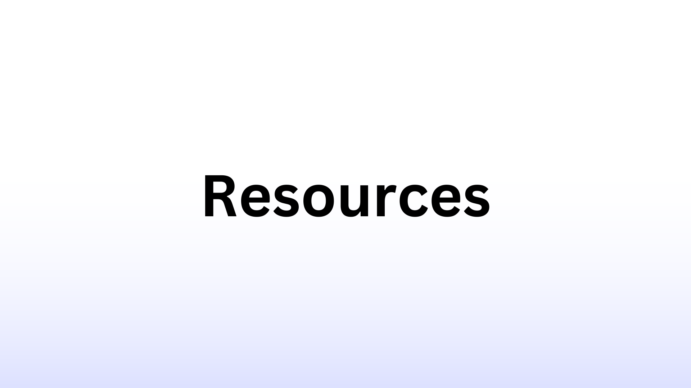
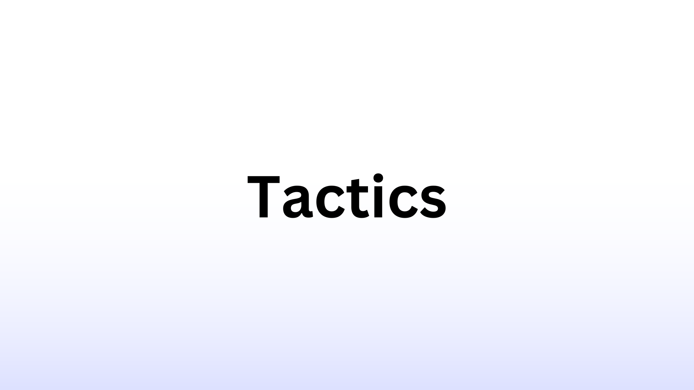
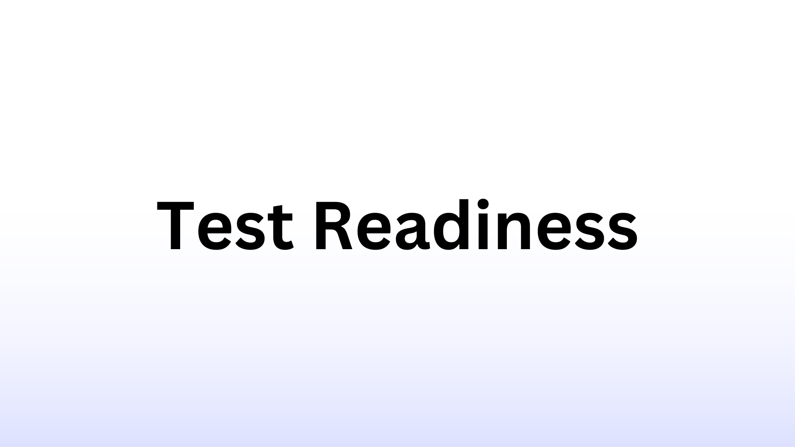

# Introduction

In this article, I will explain and document the process and resources I used to become the youngest **Amazon AWS Certified Developer - Associate (DVA-C01) holder in Viet Nam**.

## 1. What is AWS?

As you know, Amazon Web Services (AWS) is a cloud computing platform and infrastructure created by Amazon.com. It provides a wide range of services such as computing, storage, databases, analytics, machine learning, and much more, that can be utilized over the internet on a pay-as-you-go basis. AWS is one of the largest and most popular cloud computing platforms in the world, and it serves millions of customers, including startups, enterprises, and government organizations. Its services are designed to make it easier for customers to build and run applications, store and analyze data, and scale their operations in a cost-effective and secure manner.

## 2. What is AWS Certification?

AWS Certification is a series of certifications provided by Amazon Web Services (AWS) for individuals who demonstrate proficiency in using the AWS platform. There are several levels of AWS Certifications, including foundational, associate, professional, and specialty certifications. The certifications assess an individual's ability to design, deploy, and manage applications and services on the AWS platform.

## 3. What is Amazon AWS Certified Developer - Associate?

The AWS Certified Developer - Associate certification is intended for individuals who have a good understanding of the AWS platform and have experience developing and maintaining applications on the AWS platform. It is recommended that candidates have at least one year of hands-on experience in developing and deploying applications on AWS, although there is no strict requirement in terms of years of experience.

This certification is ideal for software developers, software architects, and DevOps engineers who want to demonstrate their expertise in developing, deploying, and troubleshooting applications on the AWS platform. The certification provides recognition for the skills and knowledge required to design, build, and maintain secure, scalable, and highly available applications on AWS.

# About me

I’m a **FullStack IoT Developer, currently studying in Budapest, Hungary**. Before taking the test, I have not gotten 1 year of experience in AWS as recommended by Amazon. However, I have had experience with developing applications on **Heroku, Firebase, Google Cloud and IBM Cloud**. Therefore, it was quite straight-forward for me to grasp the system and layout of Amazon AWS.

Recently, I took and passed the AWS DVA-C01 Exam on 11/02/2023 at **18 years 9 months old**, making me the youngest ever in Viet Nam to pass it. You can find my cerification [here](https://www.credly.com/badges/a580540a-ddcd-401b-a6dd-1f0819824483/public_url).

# Resources

These are the resources I used to prepare for the exam. They are the only source of information I refer to while I study for DVA-C01, and it is really minimal compared to other sources. Although it is compact, fully mastering these documents will certainly help you pass the exam easily.

I also included the cost of each material, which will help you calculate the cost of this certification.

## 1. Stephane Maarek's Course (99$ - bought on discount for only 20$)

This brilliant guy is definately the guru on Amazon AWS, and **if you want to achieve any of AWS certification, you go to Stephane**. His courses are easy to understand, with carefully crafted sections, which will ensure you a solid base before going into the exam.

That is why I am reccomending [his course on DVA-C01](https://www.udemy.com/share/101WES3@qEwYb0AUDGHJ2cbBK4r_CPl7pcZ5wpwmFzlNIR1tb1pe2qghAFKRnNQlwbKZa5EIVw==/). Apart from Stephane, there are also multiple other courses on the internet, and you can pick any of them. However, be sure to follow at least one course for your exam.

## 2. Stephane Maarek's Practice Tests (80$ - bought on discount for only 15$)

**Practice tests are a must**. And Stephane has made really easy for you to [purchase his practice tests](https://www.udemy.com/share/101YDy3@GFihf8emI9iP9n-RJYcCW-98abiLNABb7-jLeK93AO7DR880o0aAon2_dBcvLR1ptg==/) (6 in total, with full explainations), on which thousands of people have used and succeeded, including me.

Apart from his, there are endless practice tests on the internet, even from Amazon itself, but I should state that I have only used Stephane's in my learning process. His tests are close to the real tests, for at least 60% of the questions. This statistics can even be higher on your exam though, as my exam was testing new questions and materials for the upcoming DVA-C02 (derived from my opinion and experience).

## 3. CodeBucket's Cheatsheet (Free)

Cheatsheets are not a must, but they are certainly helpful. After hours of searching on the internet for an actually helpful cheatsheet, I came across [CodeBucket's](https://codebuckets.com/2022/12/04/aws-developer-associate-cheat-sheet/).

This is the best cheatsheet you can ever find, and if you are able to understand it, you have the exam in the palm of your hand. The developer behind this cheatsheet recently took the exam in 2022, and he has made a wonderful guide into how to ace the exam.

## 4. Amazon AWS Documents (Free)

If you are a developer, you must know how to read [documents](https://docs.aws.amazon.com/). Maybe this resource is not important in other tactics, but with the tactics I used for this exam, you will spend hours reading the documents while doing your practice tests.

# Tactics

Having the resources for the exam doesn't mean much if you can't utilize them correctly. In this section, I will devise tactics for you to making the most out of your resources.

## 1. Time Management

Amazon advised engineers to take the exam after they have gotten **one year of experice and learning with Amazon AWS**. However, this is not a requirement for the exam, and you should be able to take it in **3-6 months of comprehensive learning**.

To learn, you need to **be disciplined and control your time correctly**. In the course I have reccommended, you have **31.5 hours of videos**, and you should never speed run it. That means no watching 5-6 hours in a day and finish in a week.

You should take your time, and learn **at least 1 hour a day, 5 days per week** . Now, the schedule can change, but the basic is you have to **learn day-by-day to retain your knowledge**. If you're new to AWS, you need time to adapt and remember AWS concepts, or else you will just forget about it.

And don't be afraid when you don't remember something. It is a benefit of online learning to learn at your pace, don't hesitate to review a section if you have not understand it fully.

My tip is to **just learn then review later**. You bring temporary data into your brain ElastiCache, then let your brain slowly move it to Elastic Block Storage. Cough... AWS joke.

## 2. Practice Management

For practice tests, I devised a tactic I learn from AI/ML training. You see, humans are the I in AI, so we can learn from them by **dividing our data sets to training and test sets**. It is honestly a bit weird though.

We have 6 practice tests in the bundle, and what I like to do is to seperate it into 2/4 sections:

- For the first 2 tests (test set), we do it **without any help or documentation**. This helps us assess our abilities after finishing the course and helps us improve our tactics.
- For the next 4 tests (training set), we do it with help from **Amazon AWS docs and CodeBucket's cheatsheet**. For every question you don't know the answer, search for the keywords online. This helps boost your logical thinking and make you remember longer because you are actively finding for the answer. Don't leave behind any unanswered question.

After taking the practice tests, **wait for 1-3 days**, it is for your brain to relax. Then **take the tests again**, this time without any help, just like the real tests. Through this process, you will find places you truly need improvements on.

For the pace of doing the tests, I reccomend taking **1 test per day** using my tactic. This should be done continously, without any cheat day unless specified in the tactic.

## 3. Cheatsheet Utilization

Knowing how to use your cheatsheet is actually critical. If you follow **CodeBucket's Cheatsheet**, you will find a **80-page long** document of very compact knowledge. However, it could be even more compact.

To remember the concepts, I have written my own cheatsheet from **CodeBucket's** which only spans **30 pages**. However, I will not share it, as it is a very good practice for you to do it on your own.

Again, **this cheatsheet contains everything**. If you do Stephane's tests with the cheatsheet, you will score above 90% everytime.

# Test Readiness

This is specifically for **Practice Management**. If you want to know when you are prepared or ready, these are my results for you to compare to. It won't probably help, but it is something that can comfort you if you are having doubts.

For my first run on the practice tests, my scores are the following: **69% Failed, 70% Failed**, 83% Passes, 83% Passed, 95% Passed, 85% Passed.

For my second run on the practice tests, my scores are the following: 92% Passed, 80% Passed, 95% Passed, 92% Passed, 100% Passed, 93% Passed.

This part is only for reference purpose and it is not an indicator of success on the exam.

# Endnote

The AWS exam is a hard and stressful test to take. I hope this article will be a helpful guide on how to prepare for the exam.

If you pass the exam and my article somehow helped you, please reach out to me ^^

Good luck on your exam!!!
