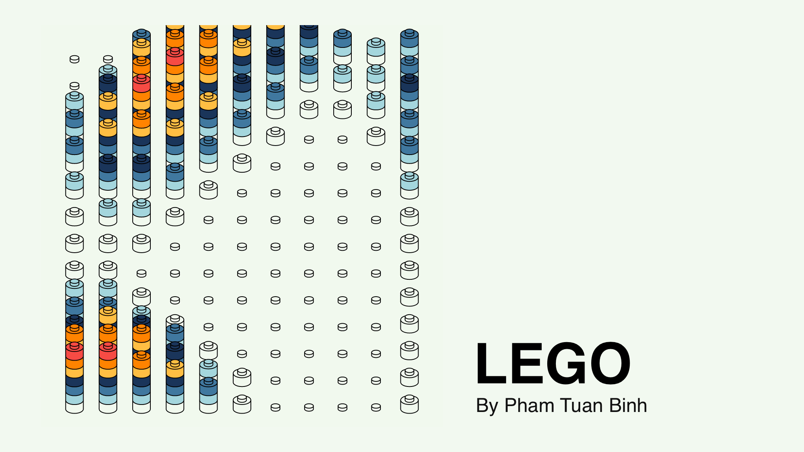

# Sponsorship


This project is done with the help of [**Bruno Imbrizi's amazing course**](https://www.domestika.org/en/courses/2729-creative-coding-making-visuals-with-javascript).

If you want to dive deeper into the world of creative coding, be sure to check out his courses on **Domestika**.

# Introduction



Apart from being a developer, I'm also an graphic designer. The two fields don't make much sense together, but with the right combination, you can make something truly wonderful. And an esssence of such wonderfulness can be found in **Creative Coding**.

Today, I'll walk you through the process of making a work of art with **Canvas-sketch**, a Node.js library that utilizes HTML5 canvas to render artworks.

# Brief Idea

Every project starts with an idea, and mine is inspired from various interpretation of **Perlin Noise** on the internet. Previously, I've followed **Matt Ross's work** on [**LEGO Instacing in Touch Designer**](https://www.youtube.com/watch?v=fu3Csj-NxyQ). And I'm struck with the idea of implenting some what of his work on a website using simpler means.







My idea is an illustration of a lego board, with every piece or stack of pieces represent their corresponding Perlin Noise coordinates and values. From the thumbnail of the article, you can somewhat imagine what our result will look like eventually.



# Core concepts

My artwork is done with multiple tools. Some of which are more important than others, and I've gathered the core concepts for you to grasp in this section. I will not walkthough the boilerplates and installation of these dependencies in this article, so be sure to **read every link carefully**.

## 1. HTML5 Canvas and Javascript


The fundamental of my workflow is **HTML5 canvas**. It is a tool that helps you draw on websites, and you should be able to find various information of it on the internet. Here is a wonderful explaination from [**W3**](https://www.w3schools.com/html/html5_canvas.asp).

To deal with **canvas**, you need to use **Javascript**, a programming language. If you are used to programming before, [**grasping the concept of JS is simple**](https://htmlcheatsheet.com/js/). In this project, we only use basic Javascript: **for loops, let/const variable**.

## 2. NodeJS and Canvas-sketch


Normally, with **HTML5 canvas**, you would have to write a ton boiler-plate code and of course implement your own HTML, CSS and JS files. With **Canvas-sketch**, this process is easier and more streamlined. It is a wonderful tool made by **Matt DesLauriers**, a creative coder, and you can find more about it [**here**](https://github.com/mattdesl/canvas-sketch).

To use Canvas-sketch, you will **NodeJS**, which helps you run JS without the need of a browser (in simple terms). You can find how to install it [**here**](https://nodejs.org/en/).

## 3. Perlin Noise


**Perlin noise** is, you guess it right, random noise, but in a very special way. If you draw Perlin Noise on a 3D plane, adjacent values will be close to eachother, hence create a smooth feel to the terrain. This is the basics behine **Minecraft** terrain creation.

The **Perlin noise** in this project is used to generate **more natural** values for the heights and colors of LEGO pieces.

# Execution

With every coding problem, the main workflow is to disect it into multiple smaller problems. Likewise, in art, before designing or drawing something, we also have to partition our work into multiple smaller tasks. The same applies in **Creative Coding**.

## 1. Constants

Before coding our project, we will set up the constants we use.

```JS
// Canvas-sketch settings
const settings = {
    dimensions: [2048, 2048],
    animate: true,
    fps: 20,
    timeScale: 0.8,
};

// Color pallete, in luminance and saturation order
const colors = [
    "#f1faee",
    "#a8dadc",
    "#457b9d",
    "#1d3557",
    "#fcbf49",
    "#f77f00",
    "#e63946",
];

const brickHeight = 45; // Lego brick height
const brickWidth = 90; // Lego brick width
const maxHeight = colors.length; // Max height of a stack of Lego
const freq = 0.09; // perlin noise frequency

const matrixWidth = 12; // Matrix of Lego width
const matrixHeight = 15; // Matrix of Lego height

// Canvas Prep (Operations explained in "Drawing a shape")
// This is to color the background and set the default params of canvas operations
context.strokeStyle = "black";
context.lineWidth = 4;
context.fillStyle = "#f1faee";

context.beginPath();
context.rect(0, 0, width, height);
context.fill();
```

## 2. Drawing a shape

To draw our lego board and pieces, we will need to draw basic shapes, these include eclipses and rectangles. The process of drawing a simple shape can be described below.

```JS
// Getting the canvas object
// With traditional file
let canvas = document.querySelector("canvas");
let context = canvas.getContext("2d");

// With Canvas-sketch
const sketch = () => {
    return ({ context, width, height, time }) => {
    }
};

canvasSketch(sketch, settings);

// Drawing a shape
context.strokeStyle = "black"; // stroke color
context.lineWidth = 4; // stroke width
context.fillStyle = "#f1faee"; // fill color

// A rectangle with stroke
context.beginPath(); // begin drawing
context.rect(0, 0, width, height); // draw a rect path
context.fill(); // fill that path
context.stroke(); // draw a stroke along that path
```

## 3. Drawing an eclipse

To make our code easier to read, we should write different functions for individual shapes. The one below is for eclipses. Remember that **x,y** is the center of the eclipse.

```JS
// The fill color and stroke style should be sustained from previous setup
function drawEclipse(context, x, y, radiusX, radiusY, rotation, curve) {
    context.beginPath();
    context.ellipse(x, y, radiusX, radiusY, rotation, 0, curve * 2 * Math.PI);
    context.fill();
    context.stroke();
}

// We also need to have an eclipse without a stroke, this will be explained later
function drawEclipseWithoutStroke(context, x, y, radiusX, radiusY, rotation, curve) {
    context.beginPath();
    context.ellipse(x, y, radiusX, radiusY, rotation, 0, curve * 2 * Math.PI);
    context.fill();
}
```

## 4. Drawing a cylinder

To draw a cylinder, we need 3 eclipses and a rectangle.

```JS
function drawCylinder(context, x, y, w, h, offset) {
    // First, we draw the bottom eclipse
    drawEclipse(context, x, y, w / 2, offset, 0, 0.5);

    // Then we draw the overlay rectangle on top
    context.rect(x - w / 2, y - h, w, h);
    context.fill();
    context.stroke();

    // Then we draw an eclipse to hide the stroke of that rectangle
    drawEclipseWithoutStroke(
        context,
        x,
        y,
        w / 2 - context.lineWidth / 2,
        offset - context.lineWidth / 2,
        0,
        1
    );

    // Then we draw the top eclipse
    drawEclipse(context, x, y - h, w / 2, offset, 0, 1);
}
```

## 5. Drawing a LEGO piece

To draw a LEGO piece, we need 2 cylinder.

```JS
function drawLego(context, x, y, w, h) {
    // The big one
    drawCylinder(context, x, y, w, h, h / 2);

    // The small one, or the snap part
    // The sizes are calculated through the process of randomizing values :))
    drawCylinder(context, x, y - h, w / 2, h / 3, h / 4);
}
```

## 6. Drawing a stack of LEGO pieces

To draw a stack of LEGO pieces, we only need to offset the next lego piece by the height of the previous one.

```JS
function drawStackOfLego(context, x, y, w, h, num) {
    for (let i = 0; i < num; i++) {
            // Select color in pallete
            context.fillStyle = colors[i];

            // Draw lego in that color
            drawLego(context, x, y - h * i, w, h);
    }
}
```

## 7. Drawing an array of LEGO stacks

To draw an array of lego stacks, we need to have nested loops and offset the coordinates of our path according to the values of the loops.

```JS
// Perlin noise lib
const random = require("canvas-sketch-util/random");

for (let i = 1; i < matrixHeight; i++) {
    for (let j = 1; j < matrixWidth; j++) {
            // Like a lego board, we need to have spokes on every placement of the board
            drawCylinder(
                context,
                (width / matrixWidth) * j,
                brickHeight + (height / matrixHeight) * i,
                brickWidth / 2,
                brickHeight / 3,
                brickHeight / 4
            );
    }
}

for (let i = 1; i < matrixHeight; i++) {
    for (let j = 1; j < matrixWidth; j++) {
            // This is where we draw the stacks of lego
            // Val is the perlin noise value (0,1)
            let val = random.noise3D(j, i, time, freq);

            // For the stack num, we interpolate val range to maxHeight range
            // Other params are constants which we have already set
            drawStackOfLego(
                context,
                (width / matrixWidth) * j,
                brickHeight + (height / matrixHeight) * i,
                brickWidth,
                brickHeight,
                Math.ceil(val * maxHeight)
            );
    }
}
```

# Demonstration

You can run the artwork on your own browser [**on this website**](/lego).



The sketch code can be found below:

```JS
const canvasSketch = require("canvas-sketch");
const random = require("canvas-sketch-util/random");
const math = require("canvas-sketch-util/math");

const settings = {
  dimensions: [2048, 2048],
  animate: true,
  fps: 20,
  timeScale: 0.8,
};

const colors = [
  "#f1faee",
  "#a8dadc",
  "#457b9d",
  "#1d3557",
  "#fcbf49",
  "#f77f00",
  "#e63946",
];

function drawEclipse(context, x, y, radiusX, radiusY, rotation, curve) {
  context.beginPath();
  context.ellipse(x, y, radiusX, radiusY, rotation, 0, curve * 2 * Math.PI);
  context.fill();
  context.stroke();
}

function drawEclipseWithoutStroke(
  context,
  x,
  y,
  radiusX,
  radiusY,
  rotation,
  curve
) {
  context.beginPath();
  context.ellipse(x, y, radiusX, radiusY, rotation, 0, curve * 2 * Math.PI);
  context.fill();
}

function drawCylinder(context, x, y, w, h, offset) {
  drawEclipse(context, x, y, w / 2, offset, 0, 0.5);
  context.rect(x - w / 2, y - h, w, h);
  context.fill();
  context.stroke();
  drawEclipseWithoutStroke(
    context,
    x,
    y,
    w / 2 - context.lineWidth / 2,
    offset - context.lineWidth / 2,
    0,
    1
  );
  drawEclipse(context, x, y - h, w / 2, offset, 0, 1);
}

function drawLego(context, x, y, w, h) {
  drawCylinder(context, x, y, w, h, h / 2);
  drawCylinder(context, x, y - h, w / 2, h / 3, h / 4);
}

function drawStackOfLego(context, x, y, w, h, num) {
  for (let i = 0; i < num; i++) {
    context.fillStyle = colors[i];
    drawLego(context, x, y - h * i, w, h);
  }
}

const sketch = () => {
  return ({ context, width, height, time }) => {
    const brickHeight = 45;
    const brickWidth = 90;
    const maxHeight = colors.length;
    const freq = 0.09;

    const matrixWidth = 12;
    const matrixHeight = 15;

    context.strokeStyle = "black";
    context.lineWidth = 4;
    context.fillStyle = "#f1faee";

    context.beginPath();
    context.rect(0, 0, width, height);
    context.fill();

    for (let i = 1; i < matrixHeight; i++) {
      for (let j = 1; j < matrixWidth; j++) {
        drawCylinder(
          context,
          (width / matrixWidth) * j,
          brickHeight + (height / matrixHeight) * i,
          brickWidth / 2,
          brickHeight / 3,
          brickHeight / 4
        );
      }
    }

    for (let i = 1; i < matrixHeight; i++) {
      for (let j = 1; j < matrixWidth; j++) {
        let val = random.noise3D(j, i, time, freq);

        drawStackOfLego(
          context,
          (width / matrixWidth) * j,
          brickHeight + (height / matrixHeight) * i,
          brickWidth,
          brickHeight,
          Math.ceil(val * maxHeight)
        );
      }
    }
  };
};

canvasSketch(sketch, settings);

```

# Endnote



**Creative Coding** is an amazing field, if you are a graphic designer and you have the time, be sure to check out the wonders of it.

For creative coders and learners, feel free to modify my artwork. With minor modifications, you can create totally different variations of it.

Thank you for reading **Binh's Archive**.
