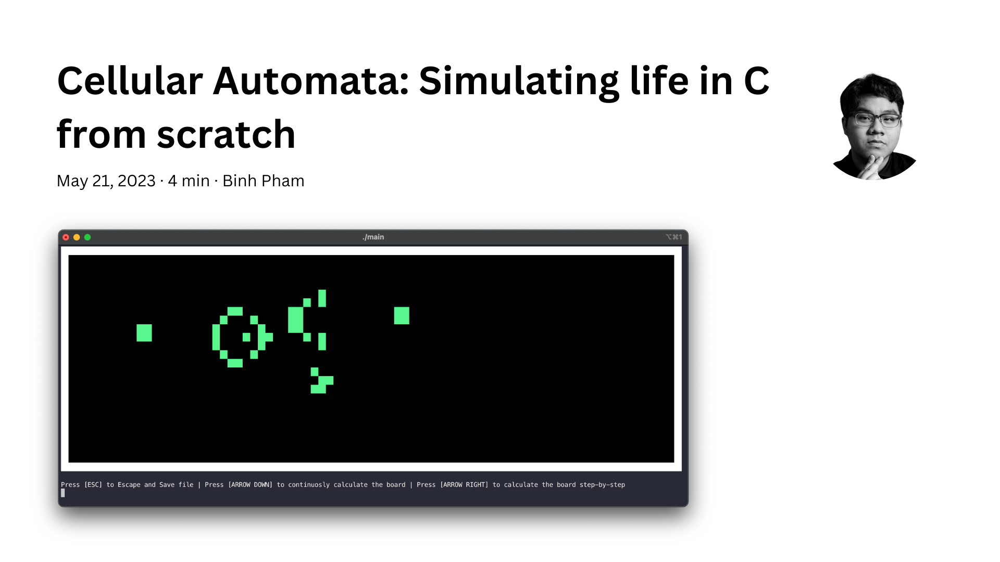

# Brief

This is **not a how-to article**. This is a project that has been done a while ago by me for **my final project in C** at **Budapest University of Technology and Economics**. Through this article, you can find:

- The **source code** of the project: Including bash scripts/makefile to build the project.
- The **developer documentation**: Including documentation of every struct and every critical functions.
- The **manual**: step-by-step instruction of how to use the program.

# Introduction

In my **first year at BME**, I was tasked with **developing a project in C** for my **Basics Of Programming 1**. Back then, I wasn’t exactly a beginner in C, so I wanted to find some projects that was really fun and cool to do.

That was when **the concept of Cellular Automata** caught my eye. If you don’t know what cellular automata is, it is basically a game with black and white boxes. This game has **levels** and at each level the **color of a box is decided by its neighbors**. For example, if a black cell is surrounded by 2 black cells, it turns white. A game can have **multiple conditions** and these conditions are g**rouped under a rule**, like **Rule 30**.

This simple description of a rule is the background for many other rules of cellular automata. These rules are created under a **naming convention**: **Rule N**, in which N is a number indicating the rule itself.

As the levels get higher and higher, the complexity of the boxes combinations gets higher as well.

Now, you may have spotted the main point of the game. **What if we change the rule of each level?** Like a white box turn to black if it has 4 black neighbors. This is actually an insanely interesting topic and might hold the answer to the existence of our universe right now.

The **set of rules** for this game can be **arbitrary complex**. From this, a crazy scientist called **Stephen Wolfram** has researched a **new kind of science** that is based totally on the workings of the rules of this game. From a set of rules, he can **simulate real deterministic events** such as forest fires or stocks fluctuation in our world. Then it begs the question: **How complex does a set of rules need to be to simulate our world?**

This is totally **out of scope of the article**. Therefore, I will leave the researching back to you.

In this project, we will only discuss the most famous set of rules of them all: the **Conway’s Game of Life**. In this set, the rule are of the following:

- If the box is white, then it stays white if it has either 2 or 3 white neighbors
- If the box is black, then it turns white in the case that it has 3 white neighbors
  This may sound like a racist game, but in actuality, the states of the box are called alive/dead and the box is called cell. It was easier to explain it with shapes and colors though.

Back to the main point, my project in C was basically a game, in which you can:

- Run the game of life
- Draw a board with cells and their states
- Save a board with cells and their states

Mark in mind, this has to be **done totally from scratch**, **without external libraries**, except for an input-handling library. That means, for the board drawing and the game, not only do you have to implement the logic, you also have to build the interface from scratch.

# Project Demo

Below is a Video Demo of the project, in which you can possibly know why I shared this project: **it looks freaking cool for a from-scratch project!**



# Project source

As stated from before, this article is only to show the main point of the project. You can find the project source on [**my GitHub**](https://github.com/pham-tuan-binh/life-c/). Leave a star if you like it as well.

In the repository, you can find the **documents** in the **/doc/**. In here, you can find the:

- Specifications on which I build my project.
- Developer Document
- Manual

For **compiling and running the game**, please refer to the **README.md on GitHub**.

# Honorable Mention

In this topic, I also want to introduce another book which to me is the ultimate coding book: [**The Nature Of Code** by **Daniel Shiffman**](https://natureofcode.com/). In this book, you can find topics such as:

- Cellular Automata
- Neural Network
- Particle Systems

This is insanely helpful if you want to dive into **how the world can be simulated with plain coding**. This book is literally the inspiration of nearly half of my projects until now.
