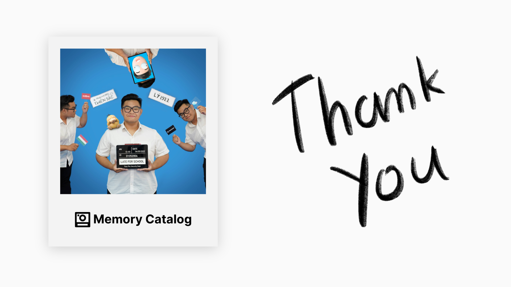

# Lời tri ân

**Memory Catalog** là một ý tưởng của một người bạn của mình, được hoàn thiện hoá bởi mình.

Qua bài viết này, mình muốn gửi lời tri ân đến người đã giúp mình xây dựng dự án này từ ban đầu. 

# Lời mở đầu

Đối với những bạn đã theo dõi mình trên Instagram từ lâu, có lẽ **Memory Catalog** không là một dự án quá xa lạ.

Mọi thứ bắt đầu khi bạn mình có ý tưởng về một nơi viết **lưu bút riêng**, khác với những lựa chọn sẵn trên thị trường.

Vào thời điểm đó, đa số mọi người sẽ chọn viết lưu bút qua các nền tảng như google form, type form hoặc viết tay. Tuy nhiên, các nền tảng này đều có những sự **bất tiện** riêng, ví dụ như thiếu tuỳ biến, đắt tiền, tốn thời gian,…

Ngoài ra, bạn mình cũng có ý tưởng về việc **gắn ảnh** với các bạn học để có một chiếc lưu bút ý nghĩa nhất có thể, một điều mà chưa có nền tảng form nào hỗ trợ tốt.

Dựa trên ý tưởng này, thay vì sử dụng các giải pháp tốn tiền, mình đã làm nên một chiếc form riêng của mình và gọi nó là **Memory Catalog**.

# Memory Catalog là gì?

**Memory Catalog** là một nơi các bạn có thể chia sẻ những kỉ niệm cùng mình. Thay vì viết lưu bút, bạn có thể chia sẻ **những bức ảnh và câu chuyện** về nơi chúng ta đã đi cùng nhau, các món ăn, những lần đi xem phim hay đi chơi,… Những bức ảnh này sẽ được lưu trữ dưới dạng **ảnh Polaroid** trên website **Memory Catalog** và có thể được xem bất cứ lúc nào trên website này.

Mặc định, những kỉ niệm của các bạn sẽ được chia sẻ **công khai**, nhưng các bạn cũng có thể bật chế độ **private** để chỉ có mình đọc được.




Các bạn có thể xem cách viết và đăng một kỉ niệm ở video này. Nếu bạn muốn thử dùng **Memory Catalog**, bạn có thể truy cập [tại đây](https://memory.binhph.am)

# Quá trình làm Memory Catalog

Có lẽ sẽ hơi bất ngờ nhưng tổng thời gian mình làm **Memory Catalog** từ đầu đến cuối chỉ là **14 tiếng**. **Memory Catalog** là một thử thách solo Hackathon trong 12 giờ của mình. Tuy chệch 2 tiếng khỏi thời gian quy định, mình cũng đã rất vui vì đã hoàn thành dự án này. 

Đối với các bạn muốn làm quen với Hackathon, workflow của mình khá là đơn giản, do ngay từ đầu mình đã xác định rõ stack mình sẽ dùng. Các công việc để biến dự án này thành hiện thực có thể được liệt kê sau đây:
- Thiết kế Website (Dùng Affinity Design)
- Lập trình BackEnd (NodeJS và ExpressJs)
    - Thiết kế và test API (ExpressJs và Postman)
    - Thiết kế cơ sở dữ liệu (FireStore của Firebase)
- Lập trình FrontEnd (VueJs và TailwindCSS)

Tất cả được host trên **Heroku**.

Về phần **source code** của dự án này, mình xin phép không chia sẻ. Mọi người muốn phát triển thêm ý tưởng này có thể liên hệ với mình và chúng ta sẽ làm việc với nhau.



# Lời kết

Bài viết này là một bài viết nằm trong chuỗi các bài viết về những dự án cá nhân của mình. 

Các bạn có thể truy cập **Memory Catalog** [tại đây](https://memory.binhph.am). Nếu chúng ta quen nhau, hãy không ngại mà viết lưu bút cho mình nhé ^^

Các bạn có thể tìm hiểu thêm về các dự án khác trên trang **Tiếng Việt** hoặc **Tiếng Anh** của **Binh’s Archive**.

*Các bài viết trên các trang có nội dung khác nhau. Đối với mỗi dự án, mình sẽ chọn một cách truyền tải khác nhau và ngôn ngữ đóng vai trò quan trọng trong việc này. Chính vì vậy, sẽ có những dự án chỉ được viết trong Tiếng Anh hoặc Tiếng Việt.*