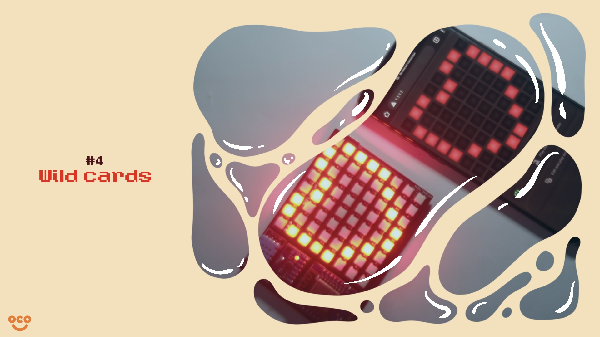

If you haven't read [**The History of NeoCoat**](), you can read it here.

As I learned more and more, I realized the key to learning was sharing. If I kept everything I've done for myself, I can't grow as a Maker or as anything. To truly break that limit, I'm motivated to share my projects and opinions as articles so they can live on forever in an archive.

Searching for a project to start this "archive", I stumbled upon **NeoCoat** and found it as the perfect candidate. It is fun and weird and... weird. For the majority of my audience, it is approachable, non-academic and DIY-able. 

However, writing about some projects you made years ago ain't sound like fun, it doesn't show what I'm capable of now and how I've grown as a Maker. Therefore, I decided to make **NeoCoat (2)**.

**NeoCoat (2)** was made with a simple purpose: **to go beyond**. This means going beyond the first NeoCoat's quality as well as going beyond myself as a Maker. Besides, I'm bored so I need something to kill time.


# Let's build a new NeoCoat

*So what does it mean to go beyond the first NeoCoat's quality? Hasn't it been made with care and perfection from the start?*

No product can be made from the start with perfection. Only through trials and errors did I find new improvements and features for NeoCoat to grow. In this case, NeoCoat was bugged with several pain points:
- The case was **fragile**, easy to break upon the slightest impact.
- The wirings was done **hastily** with **little care**, containing high risks of short circuit or hardware failures.
- Requires constant power, **not portable**.
- **Limited** functionalities.

To solve these issues, **EasyEDA** was my go-to. Using its Sketch designer, I drew the schematic of the NeoCoat with new components added.



As you can see in the schematics, there were 5 new components:
- An accelorometer and a Gyroscope
- A temperature sensor
- Buttons
- Indicator Leds
- Charging module

These components were then located on a small PCB that was also designed on **EasyEDA**.



Waiting is the key to success now as I wait for the PCB to be manufactured and delivered from China. The provider I used was [**Thien Lam PCB**](https://thienlampcb.com/). Their PCB mask was top-notch, surpassing the quality of **ThegioiIC** or **Hatakey**. Furthermore, for orders below 500.000VND, you don't need to pay upfront.

After one month of loitering, I recieved the package and here it was.



For the ingridients, I order them on [**ThegioiIC**](https://www.thegioiic.com/). The BOM can be found on my [**EasyEDA project**](https://oshwlab.com/mrbblq/neocoat), along with the schematics and PCB's designs.

Here are some pictures of the new NeoCoat.





If you are thinking this looks awful as a finished product, I do too. That's why I've created a new case to house this PCB in **Fusion360**. However, as I can't find any 3D printing service in Hai Phong anymore, I have decided not to include the case in the final project. Still, here is a sneak peak into what it would look like.



Additionaly, I've created diffusers for the Leds in Affinity Designer as well.



# SO what does a NeoCoat (2) actually do?

*After all this hassle, what can NeoCoat (2) actually do?*

Well... There are **four main functions** of NeoCoat. These are pretty much the old ones, but there is a little twist to it.

## 1. Draw 8-bit art

Using our product, you can **draw pixel art** and **decorate** everything with your NeoCoat.



## 2. Play Snake

You can also use it to **play Snake** when you are bored. No pixel-art display should exist without the ability to run Snake.



## 3. Create animation

When it is in idle mode, you can **play animation** on it. Unlike other projects, the animation doesn't need to be hard-coded or installed through an USB. You can control it directly on Neocoat's web interface.



## 4. Wild cards



*Limited by only three features?* 

Don't worry. The possibilities with **NeoCoat** are endless. 

Customization is a feature of our product: 
- Using the onboard MPU6050, you can turn your **NeoCoat** into a keyboard or a mouse. 
- The temperature sensor can make your **NeoCoat** into a thermostat.

What limit you are your ability to imagine... and probably your programming skill.

# Make your own NeoCoat

If you're interested in NeoCoat, continue to read this article as I'll show you how to make the barebone version of NeoCoat.

## 1. Prepare the ingridients


To start the DIY process, you have to acquire the ingredients first. There are only **three ingredients** in the minimum version:
- [**Wemos D1**](https://shopee.vn/%E2%9C%85-B%E1%BA%A2O-H%C3%80NG-6-TH%C3%81NG-M%E1%BA%A1ch-Thu-Ph%C3%A1t-WiFi-ESP8266-Wemos-D1-mini-(NodeMCU-Mini-D1)-c%C3%B3-k%C3%A8m-b%E1%BB%99-Jump-c%E1%BA%AFm-i.16504852.9442902014?sp_atk=394a5eac-21ae-47e1-81ff-b00ccaa3cd9e)
- [**Neopixel Matrix**](https://shopee.vn/M%E1%BA%A1ch-Hi%E1%BB%83n-Th%E1%BB%8B-NeoPixel-8x8-64-bit-RGB-LED-WS2812-i.494330825.8381306824?sp_atk=de6011c3-dc48-4c44-a960-f7f8dc22d6a8)
- [**PCB**](https://thienlampcb.com/)

You can buy all through the links I provided. However, with the PCB, you need to order them through **a vendor**.

The Geber files for the PCBs are included on my [**EasyEDA project**](https://oshwlab.com/mrbblq/neocoat).
## 2. Soldering


On **EasyEDA**, you can find the schematics of NeoCoat and assemble the components accordingly. This is quite straightforward and you can probably find the way by just looking at the board.
## 3. Install the firmware

If you did the previous steps correctly, you should be able to power the board through the **Wemos's Micro USB port** now.

To install the firmware, you will need to install **PlatformIO**. The tutorial can be found [here](https://platformio.org/install/cli).

Next, you'll need to install **Git**. The tutorial can be found [here](https://github.com/git-guides/install-git#:~:text=To%20install%20Git%2C%20run%20the,installation%20by%20typing%3A%20git%20version%20.).


After that, open your command line and follow the below instructions:
```
# Clone my repo
git clone https://github.com/pham-tuan-binh/neo-coat.git

# Change your working directory
cd "neo-coat/Neopixel controller"

# This will install all the libraries needed for this project
platformio lib install

# This will upload the filesystem
platformio run -t uploadfs

# This will build your firmware
platformio run -t build

# This will upload your firmware 
platformio run -t upload

# Tadah you're done
```
## 4. Control the board


If the firmware is installed correctly, you will find a new Wifi hotspot popping up in your phone's setting. It should be named **"NeoCoat"**.

Connect to this and you should be able to access NeoCoat's web interface at **"1.1.1.1"**

**Congratulations!** You can use your NeoCoat now.

# Closing


NeoCoat was my favorite side project. It doesn't solve climate change or plastic pollution but it is fun and it can make people smile. 

For most of my audience, building a NeoCoat and understanding the technologies behind it can be hard and may require a high level of dedication. However, as you read more and more, you acquire new knowledge and what boggles you now won't in the future.

It is unfortunate I can't talk about all the hassle I came through in the making of NeoCoat. If you have any question, feel free to reach me. 

> Keep doing what you love and what comes will come.
