# Introduction
This is the beginning of a series where I share my DIY projects and how to do them yourself. Through this series, I want to motivate and inspire students to be a part of the Maker Culture. Every episode will be about one of my projects, in which you can learn more about what I do, how I do, and what you can do.

The project presented here is called Neocoat, my first open-source hardware product. It was created two years ago when I had nothing better to do, and here is its story.

# Story
At the end of 2020, after wandering online, I was struck by the beautiful work by Jeremy Williams, Game Frame.

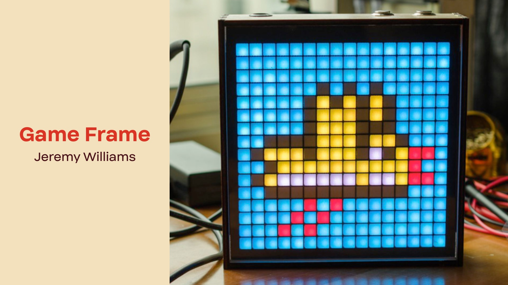

> The Game Frame was a pixel art display that you can put on your desk or hang on your wall. It gained over 150,000$ on Kickstarter with over 700 backers in 2016.

A pixelated display would be impressive, and I was motivated to make a display myself. I started to research more on past projects that have shared the same idea. Unsurprisingly, there were multiple detailed open-source projects on how to make an 8-bit display. Pixel Project by AI Linke or Pixelstick is a few successful examples.

However, they have some drawbacks:
- They only show animations and static pictures.
- They require an SD Card or Wired connections to update the display.

**Therefore, I decided to make my display from scratch with its special functions and designs.**

## Firmware
The most intricate part of this project was developing the firmware for the display. For the controller, I used Arduino and FastLed to control the pixels. The web interface was delivered by AsyncWebServer and made with pure VanillaJS, HTML, and CSS. 

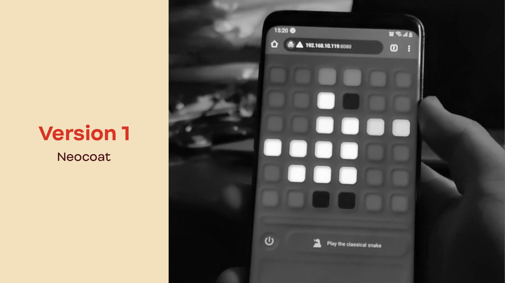

All of the source code can be found on Github. Back then, I didn't spend much time finalizing the UXUI of the web interface, so many will find this unfriendly to use. With more time on hand, this will undoubtedly be fixed in the future.

## Naming
After the firmware, I started building the casing and preparing the LED Matrix. This is where the name "Neocoat" came in place.
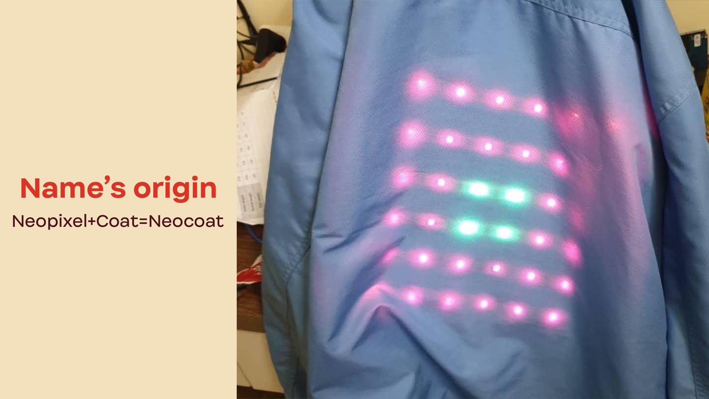
Originally, Neocoat wasn't a tiny display that you could hold in your hand and keep in your backpack. It was literally a Neopixel display on the back of a coat. At the time, I wanted to do something special, and Led on Coat was the first thing I thought of. 

## Version 1
Later on, I found this silly and made Neocoat into something better. I ordered a Neopixel matrix online and designed a case for it.
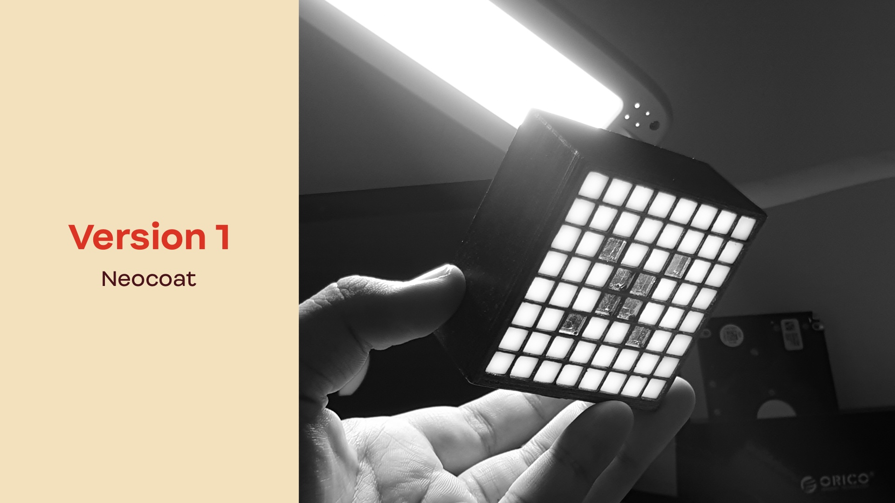
The case was 3D printed by my pals at RoytechVN, and the individual diffuser was laser cut at DreamlaserVN.
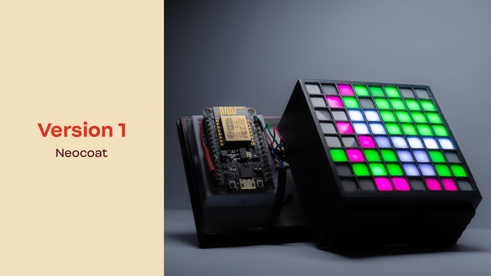
Inside the case were a nodemcu and some lousy wiring.

That's where the story ended two years ago.

## New Neocoat

Now, spreading the love for DIY electronics, I see Neocoat as the perfect example of the maker spirit. Therefore, I want it to have a proper debut on my blog. 

Furthermore, I have also developed a second version of Neocoat with every component on a PCB. In this article, I will show you the features of Neocoat V2 and how to make the barebone version of Neocoat V2.

# First look
Here is Neocoat V2.
## 1. Front
[Front picture]
## 2. Back
[Back picture]
## 3. On backpack
[On backpack]
## 4. On jacket
[On jacket]
## 5. Full options
[Full options]

# Features
Here are all the features.
## 1. Draw 8-bit art
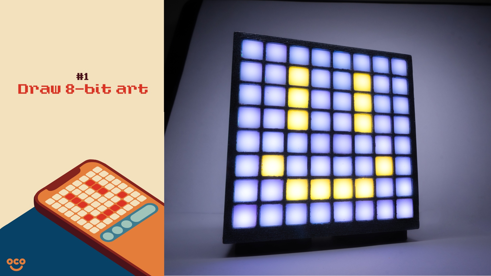
The main feature of Neocoat is the ability to showcase 8-bit art. 

Using Neocoat's web interface, you can draw and display multiple 8-bit pieces of your choice. Due to my limited art abilities and copyright limits, an 8-bit smiley face is the face of Neocoat.

## 2. Play snake
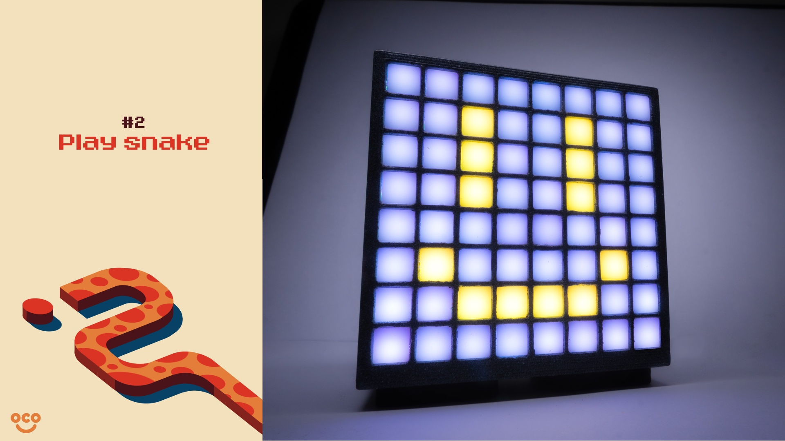
The second great thing about this project is that you can play snake on the display. 

My project won't be fun if it can't be interactive. That's why I implemented a game into the firmware of my display. It's also a unique feature of Neocoat compared to other projects. 

## 3. Create animation
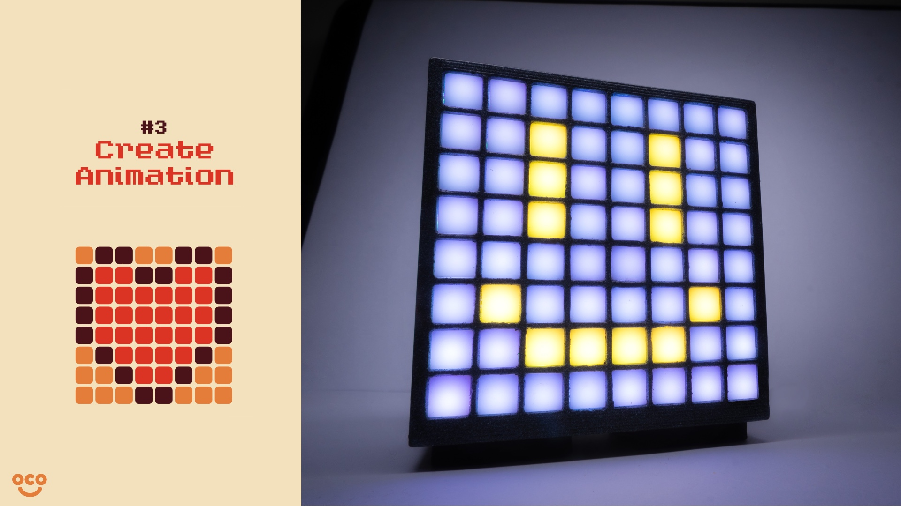
Static pictures won't be enough for an ornament. That's why I created an animation feature for Neocoat. 

This is still a limited feature, as you can only upload a low-resolution video instead of creating animation right on Neocoat's web interface.

## 4. Wild cards
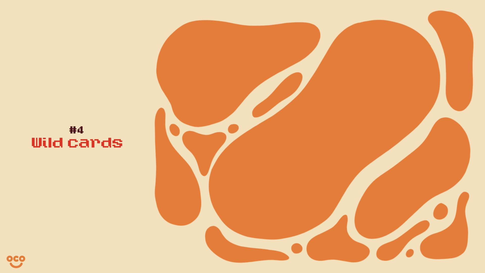
Since Neocoat is an open-source project, there is no limit on what you can do with the display. Before this article, I have made my Neocoat display into a thermostat and a tapper. All of these separate functions can be found on the Github page of this project. You can also contribute new features here through PR on Github.

# How to
In this section, I will show you how to make the barebone version of Neocoat. This version has only the PCB, the central controller, and the Neopixel matrix.

## 1. Prepare the ingridients

To start the DIY process, you have to acquire the ingredients first. Since we are building the barebone version, there are only three ingredients:
- Wemos D1
- Neopixel Matrix
- PCB

While you can buy the controller and matrix in Viet Nam, you will have to order the PCB from China. I have included the files on Easyeda and you can use these to order my PCB from any vendor you like. In this article, I will refer to Thien Lam PCB.

## 2. Solder

After step 1, you will have to solder all the ingredients together. This process is relatively straightforward, and you can probably guess how to do it from looking at the below picture.

I have some tips on soldering: don't be greedy with your solder wire. Buy the most high-quality one you can find, and you should discover soldering easy as 1 2 3.

## 3. Install the firmware

## 4. Control the board

# Neocoat's pet
Standing out is my thing. And when it comes to personal projects or "pet projects", I want each of mine to have a pet of their own literally.

Neocoat is fun and colorful. It's also quirky and cool. Therefore, I want to have a pet that exhibits these characteristics. After thinking for a while, I have selected my one and only pet for Neocoat.

🥁 3... 2... 1... Let me introduce to you Unidog.

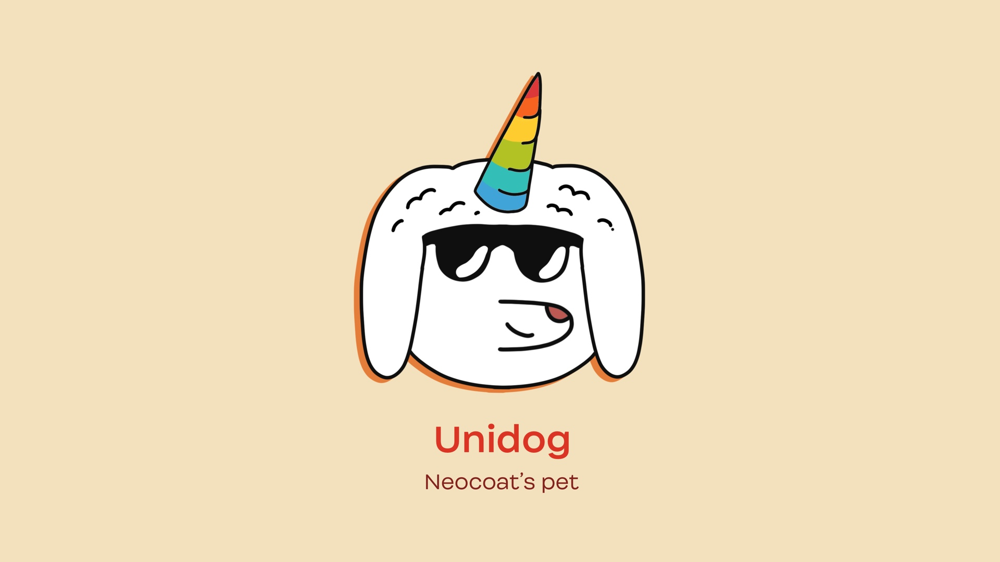

The naming is simple to understand: Unidog = Unicorn + dog. He is a magical but silly creature. On the first look, you will probably think, "What on earth is this abomination?". That's what I want you to think about my project as well. Weird and well... weird.

He is the embodiment of this project. On every article on this project, there will be a new sticker of him.

# Current limitations

With all the features Neocoat has, it also has some noticeable pain points. The largest one is the web interface. Through user testing, I have realized the lack of an intuitive UX/UI in my project. That's why I have set out to build the next version of Neocoat with the main focus on Web Interface.

However, with me being a 12th Grade student, there is no certainty on the timing of this.

# Closing
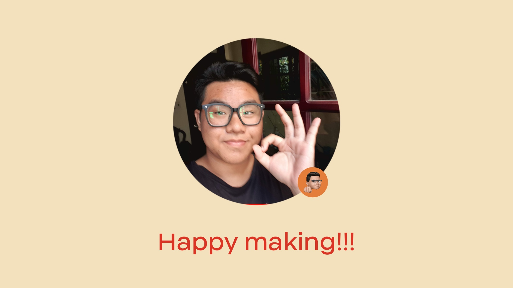
That's the end of my introduction to Neocoat V2. I hope this will show you the fun of a pet project and motivate you to participate in the maker culture. 

This is a side project of mine. Since this covers broadband of fields, I can't handle all sides with care and perfection with the limited time I have as a 12th-grade student. However, this is a good thing as there is always room for improvement. And the people who can make Neocoat great are no one but you guys. Again, Neocoat is an open-source project, and we accept contributions from everyone. A pull request or an email is all you need to get in touch with us.

Have a great day, and may you be a maker!