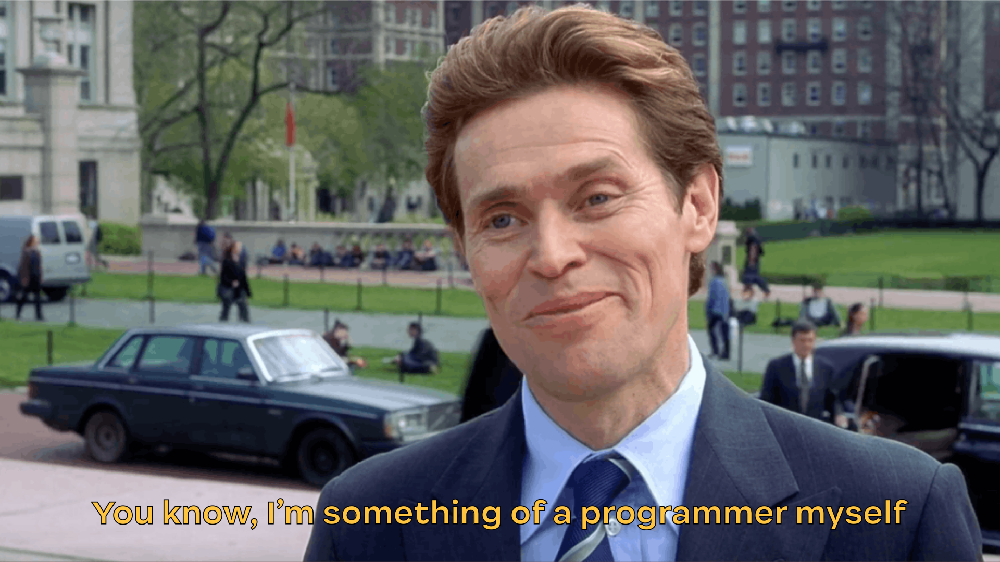

# Introduction
This is the beginning of a series where I share my DIY projects and how to do them. Through this series, I want to motivate and inspire students to be a part of the Maker Culture. Every episode will be about one of my projects, in which you can learn more about what I do, how I do, and what you can do.

The project presented here is called **NeoCoat**. It's a Pixel Display I made 2 years ago.

# NeoCoat's Inspration
At the end of 2020, after wandering online, I was struck by the beautiful work by Jeremy Williams, [Game Frame](https://www.theverge.com/2014/3/6/5475236/game-frame-classic-pixel-art-kickstarter).



His work was a beautiful feat of engineering. It brought me memories of a time when I was playing Contra and Mario with my brother on a NES. So I was really motivated to make a display myself, not only to decorate my room but also to keep a piece a memory with me. 

I started to research more on past projects that shared the same idea. Unsurprisingly, there were multiple "8-bit display" projects. [Pixel Project by AI Linke](https://ledpixelart.com/) and [Pixelstick](https://www.kickstarter.com/projects/bitbangerlabs/pixelstick-light-painting-evolved) were a few successful examples.

They were great, but they had some draw-backs:
- They were not open-source.
- They were expensive to make or buy. Some cost **200$ to 300$**.
- They **only** showed animations and static pictures.
- They requires an **SD Card** or **Wired connections** to store and update animation or pixel data.

And you know, I'm some thing of a programmer myself. **Therefore, I decided to make my own display from scratch with its special functions and designs.**

# The beginning of NeoCoat
The main idea of NeoCoat is a **firmware** that will fix its predecessors' errors and be used in a broadband of cases. As it is only a software product, its hardware of expression can be really flexible. If you want it to be a display, you can utilize a matrix of LEDs. If you want it to be a strip like Pixel Stick, you can buy a strip. In both scenarios, the software can be reused.

Then, if you were to choose a medium in which NeoCoat shined, would you choose something general that everybody had done or something weird and silly? I would pick the latter. 

But what is weird and silly that can make an 8-bit display stand out? An Eureka moment occured to me as I looked around my room. I stared at my school's coat and suddenly thought: "What if I put a display on that."



The question now would be how to do such thing. There wasn't any display on Shopee or Tiki that can fit my coat and followed my requirements.

I turned over to my crafting table and made my own display from cardboard and a few Neopixel strips. It was bad, but it worked. You can see it working in a log video below.



To control the display, I used an **ESP8266 NodeMCU**. This is a popular powerful microcontroller that supports WIFI. I put in the front pocket of my coat and connected everything to a power bank.

After that, I started building the firmware to run the LEDs. To fully explain how the firmware works, this article would be too long and boring. Avoiding that pitfall, I would only introduce the firmware's structures and technologies. If you're a programmer hoping to understand NeoCoat's inner-workings, you're welcomed at [my Github Repo](https://github.com/pham-tuan-binh/neo-coat).

The firmware uses **Arduino** framework and contains 4 main components:
1. **Drawable**: A set of APIs that help you address each LED and set their color with HSV. This is made to work with **FastLED** library.
2. **Animation**: A set of APIs that help you process MP4s and turn them into animations.
3. **Snake**: Snake's Game logic made by Emanuel Knopfel, implemented in my system by me.
4. **Web Server**: The web interface and REST APIs for controlling the display.

NeoCoat's firmware is built with Object-Oriented conventions. The naming of classes might be confusing but their functionalities are straight-foward. If you want to know more about them, open the collapse below.

- **Drawable** represents the display itself. If you want to change any properties of the display, you will need to initiate a **Drawable** object. This objects contains the size of your display, the pins to which it is connected. Through this object, you can change the brightness and color of each pixel of your display.

- **Animation** controls the animation functions of the display. By using a **Drawable** object and an MP4 decoder, it is able to render videos on your display, setting properties such as Frame-Per-Second.

- **Snake** is the Snake's logic. It takes inputs from the users and renders a matrix. This matrix is then rendered to your display using **Drawable**.

- **Web Server** is the interaction and presentation layer with the users. Through the web interface, you send commands to the controllers. These commands are then done with according libraries and functions.

## Further development
**NeoCoat on a Coat** was an amazing idea. But if I were to walk around school with a display on my back, the first time may be cool but the second would mean "I'm a nerd, please bully me".

Therefore, I wanted something small that I can put on my desk or put in my backpack. 

Immediately, I designed a simple case in **Fusion360** and sent it to my favorite 3D Printing place, [**RoytechVN**](https://roytech.vn/). They had it printed for me in 2 days and this was the result:


To diffuse the LEDs, I designed a set of simple squares in Affinity Designer. These were laser-cut at [**DreamlaserVN**](https://www.facebook.com/khaclasertaihaiphong/).

After this, I only had to stick a NodeMCU inside the case and wire it up. This was how everything turned out:


The story of NeoCoat ended there... until it was revived again for my blog.

[**The birth of NeoCoat (2)**](/posts/neocoat-2/)
