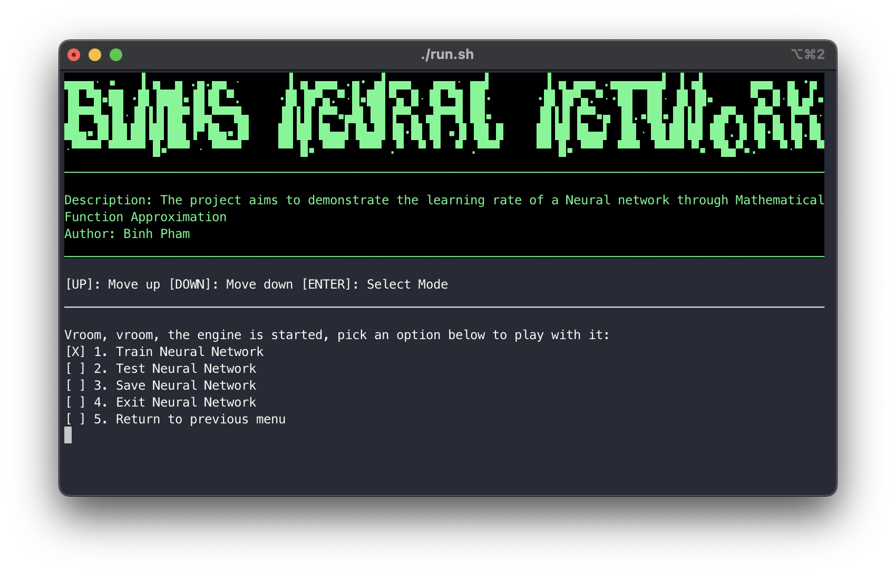
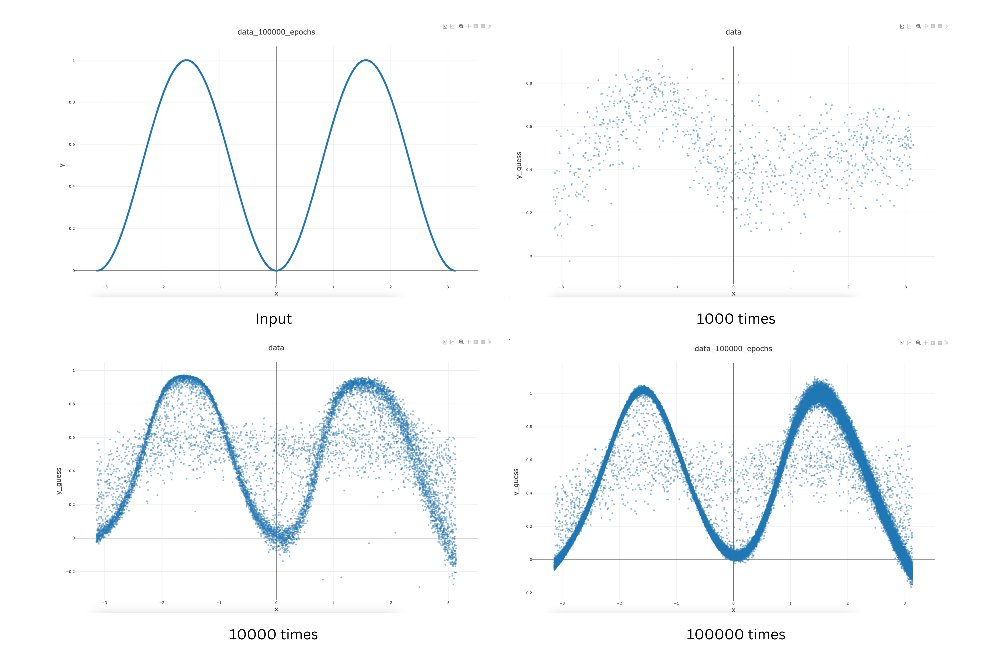
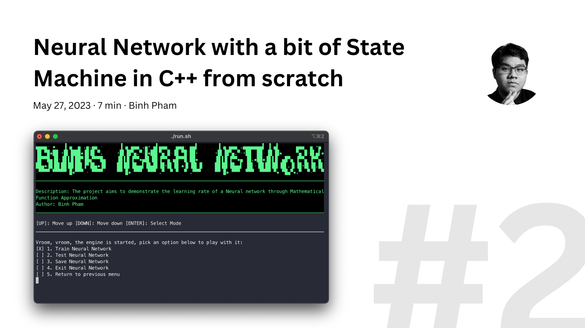

# Brief

This is a project that has been done a while ago by me for **my final project in C++** at **Budapest University of Technology and Economics**. Through this article, you can find:

- The **source code** of the project: Including bash scripts/makefile to build the project.
- The **developer documentation**: Including documentation of every struct and every critical functions.
- The **resources** to understand the project: How Neural Network and State Machine can be implemented in C++

To reduce the length of the article, the content is **divided into 2 parts**:

1. [**Part 1**](/posts/neural-network): Project introduction and demo.
2. [**Part 2**](/posts/guide-neural-network): How the project works and how it is implemented.

# Introduction

In my **second term at BME**, I was tasked with **developing a project in C++** for my **Basics Of Programming 2**. My lecturer promised that the best project in the group will get an automatic final score addition of 5 points and I was thrilled to be the best.

That was when **the concept of Neural Network** caught my eye. Amidst all the ChatGPT shananingan, a Neural Network seems to be such a buzzword of complexity. However, having a few courses of Data Science and Machine Learning under my belt from years ago, I understand that **Neural Network is just basic linear algebra**.

To gain the **precious 5 points addition**, I vouched to create a **Neural Network PoC from scratch in C++**. In the end, not only did I create a **trainable Neural Network of variable size**, I also created an **user interface from a state machine from scratch in C++**.

_And... yeah I did get the 5 points_

## 1. Project Description

Below is a **video demo** of the project, in which you can understand what the project is about.



The project is called **Binh's Neural Network**. It is to demonstrate a **Neural Network** Proof Of Concept by teaching a neural network to approximate a mathematical function **y=sin(x)^2**. The project consists of three parts:

- **Matrix**: The Matrix is coded from scratch in C++ using dynamic memory allocation for doubles. This class is used to support neurons calculation like weights multiplication, bias addition.
- **Neural Network**: The Neural Network is coded from scratch in C++ using a Matrix class and a Neural Network class. This class is used to create, train and modify a neural network using matrix calculations.
- **Controller**: The Controller is coded from scratch in C++ using basic principles of a Turing's State Machine. This class is used to handle the application logic, mainly the CLI and handle user interactions with the Neural Network.

Through the user interface, you can:

- **Create and train** a neural network.
- **Save and load** a neural network from file.
- **Benchmark** the neural network.

The project is built on the statement that:

- **No external library** is used except for **econio**: colored output and raw keyboard handling for Linux and Windows console in C and C++.
- Everything must be **built from the ground up**: reduce the usage of standard libraries as much as possible.
- **Accuracy** of the model can be **negligible** as long as: the model can show progress of learning.

Hence, the **most impressive** part of this project is that **it is built from scratch**. The only exception in this project is the usage of [**econio**](https://github.com/czirkoszoltan/c-econio), a cross-platform keyboard-handling library in C and C++.

## 2. Project Result

The testing of the project is done by iteratively training the network by **1000, 10000 and 100000 times**. After each training session, the network saves its training data which we can use to determine the performance of the network.

As you can see, as **more data points** are given to the network, it generate **more accurate output**, hence **formation of the harmonic function**.

This can even be clearer when you **test the neural network** using a **test data set** after its **100000 iteration**.



From the **training data**, we can also see **how the error of the network is reduced over time**.



The **documentation** for this **can be found** in the **project source code below**.

## 3. Project Source Code

_If you want to look at the source code right away, here is your place. If you want to know how neural network and state machine work, please proceed to the next section._

You can find the project source on [**my GitHub**](https://github.com/pham-tuan-binh/neural-network-cpp). Leave a star if you like it as well.

In the repository, you can find the **documents** in the **/doc/**. In here, you can find the:

- Specifications on which I build my project.
- Developer Document
- Other related documents

For **compiling and running the game**, please refer to the **README.md on GitHub**.

# How the project is implemented?

To understand more about the theory behind this project, please read [**\[Part 2\] Neural Network with a bit of State Machine in C++ from scratch**](/posts/guide-neural-network)
