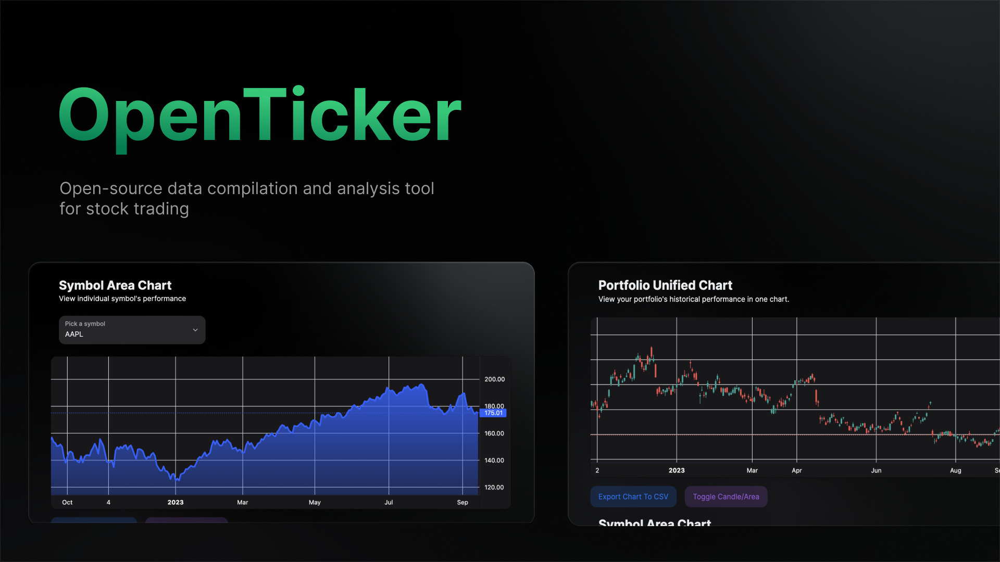
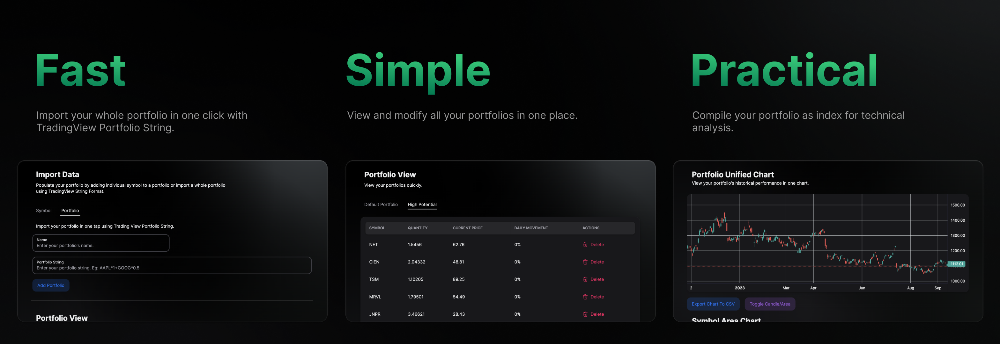
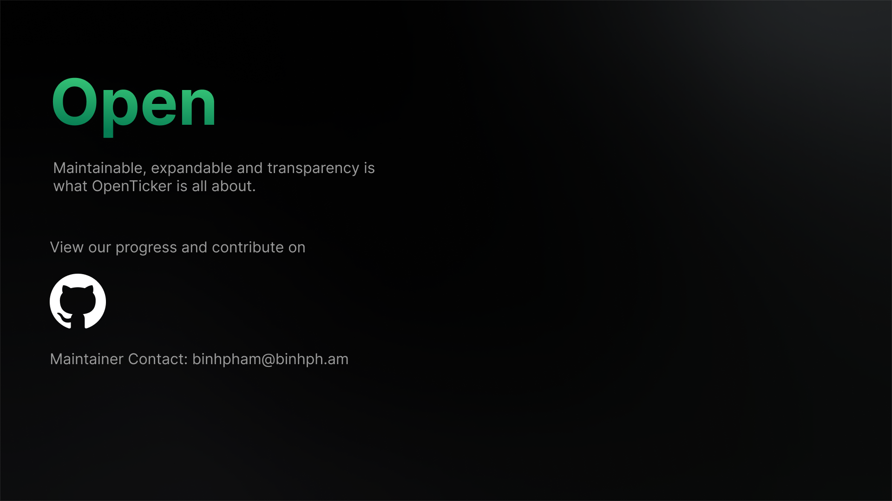

# Introduction

**OpenTicker** is an open-source data compilation and analysis tool for stock trading.

The project was initiated by **Binh Pham** when he saw that there was no free tool on the market that made portfolio analysis easy and quick. As a retail trader himself, he made a tool that he would used personally and recommend to others.

**_Skip all the hassle and [go straight to the demo](https://open-ticker.vercel.app/). Why not?_**

## Why?

> "When I built this, I simply needed a tool to compile all my symbols into a chart, so that my portfolio can be represented as a whole. But nothing do that for free or is very limited.
> TradingView supports only 10 symbols per chart. And if you want to do the same thing in excel, it is freaking nightmare.
> So I just build something that compiles the data for me, but it looks pretty cool, why not maintain it in a more stream-lined fashion?" - Binh Pham

> "The primative tool is for beginners in the stock market, for traders with medium-size portfolio who want to identify groups of correlating data in their investment early on.
> However, the project exhibits a well-defined structure and philosophy for expansion. It is built to be expandable and is expected to have more advanced features very soon" - Binh Pham

## Philosophy

The project’s development philosophy is based on three main staples:

- **Maintainable**: The project must be built with modularity and expandability in mind so developers can adapt their own solutions to the projects easily with interfaces and modules.
- **Transparent**: Every operation must be completely transparent and open. Users' data must be stored locally and process only within the application.
- **Logical**: The flow of execution in user experience and data process has to be concise and persistent throughout versions of the project.

## User Experience Flow

From an user standpoint, the logical flow of **OpenTicker** is the following:

1. **Import Data**: Users import data from external sources using Data Source Modules in **OpenTicker**.
2. **View Data**: Users view and modify their data from a dashboard using View Modules in **OpenTicker**.
3. **Compile Data**: Data is then compiled into user defined definitions using Compilation Modules in **OpenTicker**.
4. **Analyze data**: Compiled Data is then analyzed by the user or other modules in **OpenTicker**

This must be maintained and applied in every version of **OpenTicker**. The clear logical flow is what set **OpenTicker** apart from any other trading aid.

## Project's Vision

The philosophy and logical flow dictates everything the project represents. However, one question remains:

- **How can we use the project?**

Currently, the project's interface is statically built and [hosted on Vercel](https://open-ticker.vercel.app/). This is only for demo purposes.

In the future, it will be converted into a micro-service based application with concise services per the logical flow, in which the interface will only be a part of. It will be like [**Home Assistant**](https://www.home-assistant.io/) where users self-host their instance with their own expansion and customization.

## Features:

Currently, the project has the following features:

- Import data from Finnhub.
- View and create portfolio in one tap.
- View Live StockTrading data in your portfolio.
- Compile portfolio-as-index charts for technical analysis.
- Compile charts for symbols within your portfolio.
- Export CSV of compiled charts.

## Final Note

This project is still in its very early age, please report bugs and errors on [Github](https://github.com/pham-tuan-binh/open-ticker).

Bear in mind that its developer have only spent 12 hours to create this Pre-Alpha version so most input validation and performance optimization are not in place. Use the tool carefully, don't stress test it, it will definitely break.

Thanks for checking out this tool!
