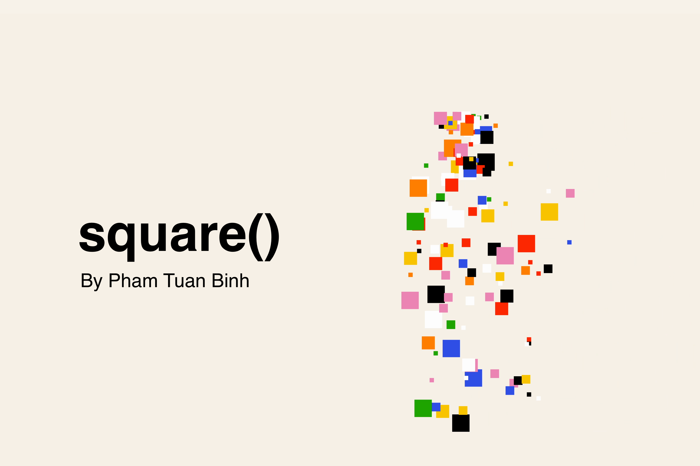

# Overall

**Square()** is an **Immersive Art Experience** I worked on while I’m bored. This art experience utilized **OpenCV and OpenFramework** to mirror its observers with colorful squares.

With bright color palettes and energetic movement, this art installation is designed to entertain its audience for at least 1 minute before they move on to other installations.

Currently this is not open-sourced, if you want to display this art work or collaborate with me in a new project, please contact me through this platform.


